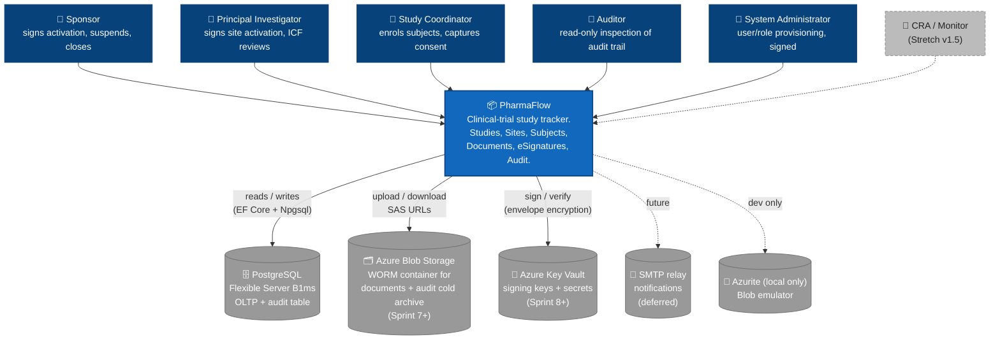

# 01 — System Context (C4 Level 1)

Highest-level view: who uses PharmaFlow and what external systems it talks to. Source: spec §2 (Roles), §3 (Entities), §8 (Stack).

## Notes

- **All actors are humans inside the sponsor's org** — there is no patient-facing interface and no public API in v1. Subjects do not log in (per spec §2.7).
- **No third-party integrations in v1** — no EDC, no IRB system, no ERP. The system is intentionally a closed island so the demo never depends on external services being up.
- **Postgres is the system of record for audit** — append-only `AuditEvent` table with rule/trigger blocking UPDATE/DELETE (spec §10.5). Blob holds documents + an *archive* of older audit rows; Postgres remains canonical.
- **Key Vault is deferred to Sprint 8** — Sprint 2–7 use a `IKeyProvider` seam with an in-process implementation; KV adapter slots in without code changes elsewhere.
- **CRA / Monitor role is dashed** — v1.5 stretch goal, no Sprint 1–11 commitment.
