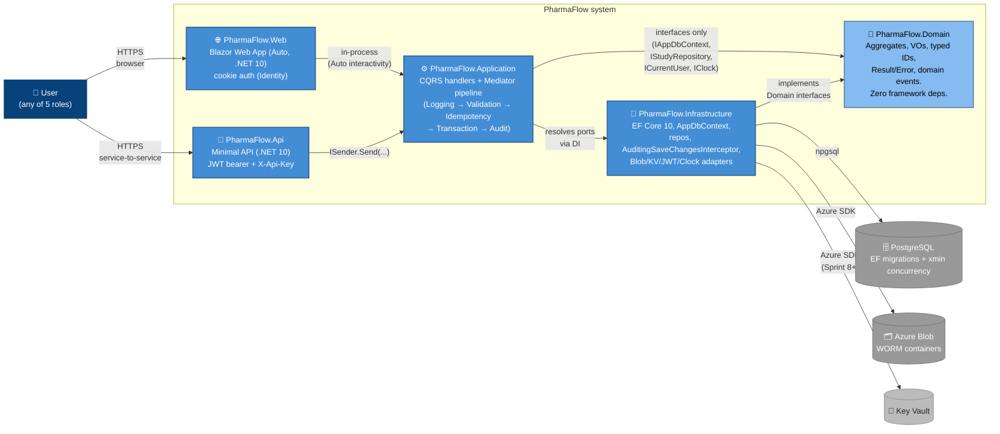

# 02 — Container Diagram (C4 Level 2)

Zooms one level inside the PharmaFlow box from doc 01: the deployable / runnable units, how a request flows, and where the auth boundary sits. Source: spec §7.1 (project structure), §9 (layered patterns), §11 (auth).

## Request flow (write path)

1. User submits form in Blazor Web → component calls API endpoint over HTTPS (or in-process during Auto Server-prerender).
2. `PharmaFlow.Api` endpoint group authenticates JWT, captures `Idempotency-Key` + `correlationId`, calls `ISender.Send(command)`.
3. Mediator pipeline runs **outer → inner**: `LoggingBehavior` → `ValidationBehavior` (FluentValidation, short-circuits) → `IdempotencyBehavior` (24h-cached responses) → `TransactionBehavior` (opens EF tx) → `AuditBehavior` (high-level audit row) → handler.
4. Handler: pulls aggregate via repo → calls domain method (`study.Activate(sig)`) → repo `Update` → `SaveChangesAsync`.
5. `AuditingSaveChangesInterceptor` (Infrastructure) fills `Updated*` + emits row-level `AuditEvent` records *in the same tx* — atomic.
6. `SavedChangesAsync` interceptor dispatches `DomainEvents` collected on the aggregate (Sprint 4+).

## Auth boundary

- **Web**: ASP.NET Core Identity + cookie auth. Issues JWT for downstream API calls (same process; cookies + JWT both flow).
- **Api**: JWT bearer (user) **or** `X-Api-Key` header (service-to-service). Authorization layered: scheme → policy (role + scope claim) → resource (per-aggregate via `IAuthorizationHandler`).

## Notes

- **Sprint 1 scaffold currently composes Web with direct Domain/Application/Infrastructure references** — see `03-module-dependencies.md` for the drift vs spec §7.2 ("Web → API over HTTP"). Pragmatic for Auto interactivity in v1; deferred clean-up.
- **No background workers as separate containers in v1** — `IHostedService` runs inside the API process (audit archival, signature TTL sweep, outbox flush). Worker Service split is a v2 seam.
- **No outbox dispatcher container** — outbox table schema is in place (Sprint 7+) but events dispatch in-process. v2 splits to a separate worker.
