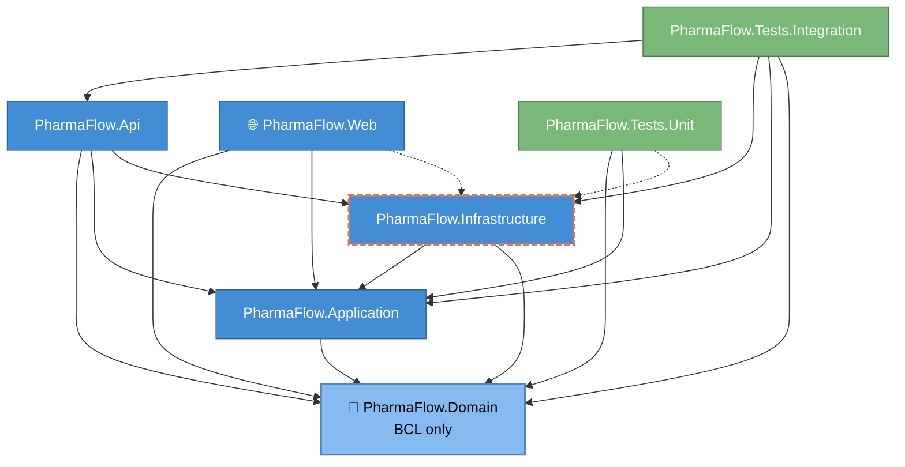

# 03 — Module Dependencies

The seven .NET projects and their compile-time references. Source: spec §7.2 (table) + actual `.csproj` `<ProjectReference>` graph as of Sprint 3 close (2026-05-10).



## Allowed reference matrix (from spec §7.2)

| Project | Depends on | MUST NOT depend on |
|---|---|---|
| **Domain** | BCL only | EF Core, ASP.NET, Mediator, FluentValidation, Serilog, Mapperly |
| **Application** | Domain, Mediator, FluentValidation, Mapperly attrs | EF Core, ASP.NET hosting, Azure SDKs, Serilog (use `M.E.Logging.Abstractions`) |
| **Infrastructure** | Application, Domain, EF Core, Npgsql, Azure SDKs, Serilog | ASP.NET hosting, Api, Web |
| **Api** | Application, Infrastructure, `Microsoft.AspNetCore.App` | EF Core types directly in endpoints (go through Mediator) |
| **Web** | **Application DTOs only** (or shared `Contracts`) per spec | EF Core, Infrastructure |
| **Tests.Unit** | Domain, Application, xUnit, FluentAssertions, NSubstitute. **Exception:** `EFCore` + `EFCore.InMemory` + Infrastructure for read-only model-snapshot tests (e.g. `StronglyTypedIdConventionTests`). No real DB connection. | Infrastructure beyond model-builder snapshot scope, real DB |
| **Tests.Integration** | Api, Infrastructure, `Testcontainers.PostgreSql`, xUnit | Mocking the DB |

## Module dependencies (within `Application`) — Sprint 5

PFL-053..056 introduced a module layer *inside* `Application` — no new projects (physical split deferred, see below). Each module is a namespace slice under `PharmaFlow.Application.Modules.{Studies,Sites}`:

- **`..Contracts..`** — the module's public API (`IStudiesModule`, DTOs). The only surface another module may reference.
- **`..Internal..`** — handlers, the module-impl class (`StudiesModule`), and a narrow per-module persistence interface (`IStudiesDbContext`, exposing only that module's `DbSet`s over the single `AppDbContext`). `internal` where the framework allows; namespace-private by convention where `public` is forced (FluentValidation assembly scanner, System.Text.Json binding).
- **`Application.Common..`** — module-agnostic primitives (pipeline behaviors, `Result<T>`). Modules depend on it; it depends on no module.

Allowed module references:

| From | May reference | MUST NOT reference |
|---|---|---|
| `Modules.Sites..` | `Modules.Studies.Contracts..`, `Application.Common..`, `Domain..` | `Modules.Studies.Internal..` (handlers, `StudiesModule`, `IStudiesDbContext`) |
| `Modules.Studies..` | `Modules.Sites.Contracts..` (none consumed yet), `Application.Common..`, `Domain..` | `Modules.Sites.Internal..` |
| `Application.Common..` | `Domain..` | any `Modules..` type |

**Cross-module call example.** `CreateSite` confirms its `StudyId` via `IStudiesModule.StudyExistsAsync` (a Studies *contract*), never an EF join — `ISitesDbContext` has no `DbSet<Study>`, so the wrong path won't compile.

**Enforcement (PFL-056).** `tests/PharmaFlow.Tests.Architecture` (ArchUnitNET, runs in CI right after build, before the unit step) encodes the rules so a violation fails the build, not a code review:

| Rule | Enforces |
|---|---|
| R1 | No cross-module `..Internal..` dependency (symmetric Sites⇄Studies). |
| R2 | Cross-module references only to `..Contracts..` (subsumes R1). |
| R3 | `internal` handlers + module-impl classes stay non-public. *Narrowed* — validators/DTOs/DbContext interfaces are public by DI/STJ necessity, so the namespace + dependency rules, not visibility, are the real boundary. |
| R4 | No foreign DbContext (`Sites` ⇏ `IStudiesDbContext`, symmetric) — catches a handler reaching past its contract into another module's persistence. |
| R5 | `Application.Common..` references no `..Modules..` type. |
| R6 | Integration events (`INotification`) reside in a module's `..Contracts..`, never `..Internal..` — the R2 boundary applied to events, so a consumer can only reference what's contracted. |
| R7 | `INotificationHandler` subscribers reach the producer module only via its `..Contracts..`, never its `..Internal..` — the cross-module event path stays contract-only. |

**Cross-module events (S6, PFL-058→063).** Modules also communicate through a **transactional outbox**: a producer raises a domain event, an EF interceptor writes it to `outbox_messages` in the same transaction as the aggregate, and a background processor dispatches it in-proc (Mediator `INotification`) to a subscriber in another module — at-least-once, with idempotent consumers. Integration events live in the producer's `..Contracts..` (R6); subscribers reach the producer only through them (R7). Rationale and what's deferred to S7: [ADR-0004](<../ADRs/0004-transactional-outbox.md>).

### Deferred to S6/S7 — don't overclaim

| Physical split | Status | Sprint |
|---|---|---|
| Separate module assemblies (one `.csproj` per module) | Deferred | S7 (service extraction) |
| Schema-per-module DbContexts | Deferred | S6/S7 |
| Integration events / outbox between modules | **Done** (S6) | in-proc outbox, at-least-once — [ADR-0004](<../ADRs/0004-transactional-outbox.md>); broker/HTTP transport still S7 |

Today's boundary is **logical** (namespace + contracts + arch gate) over a single assembly and a single `AppDbContext`. That's deliberate: modularize in place now, extract physically later — lower-risk than a premature split, and the arch gate stops S6's outbox work from silently re-coupling the modules.

## Drift vs spec — current state (2026-05-10)

| # | Project | Drift | Why it's there | Fix horizon |
|---|---|---|---|---|
| 1 | **Web** | References `Infrastructure` directly (orange dashed arrow above) | PFL-004 scaffold wired Web like Api so Blazor Auto-mode prerender resolves DI in-process. Spec §7.2 expects Web ⇒ Api over HTTP. | Sprint 11 (UI polish) or Sprint 12 (final hardening). Adds a `PharmaFlow.Contracts` project at the same time, splits cleanly. |
| 2 | **Web** | References `Domain` directly | Blazor components need typed IDs / `Result<T>` for forms. Pure read-only Domain types crossing the boundary is *less* harmful than Infrastructure crossing it. | Same horizon — when `PharmaFlow.Contracts` lands, move shared shapes there. |
| 3 | **Tests.Unit** | References `Infrastructure` + `EFCore.InMemory` (orange dashed arrow above) | PFL-031 moved `StronglyTypedIdConventionTests` from Tests.Integration → Tests.Unit. The test inspects `AppDbContext`'s built model via the InMemory provider — no real DB, no container, runs in milliseconds. Real-DB shape verification stays in Tests.Integration. | Live with it. The exception is narrow (read-only model-builder snapshot) and the alternative (a third "Tests.Snapshot" project) is over-engineering. Reassess if more Infrastructure-touching unit tests accrue. |

Both drifts are tracked here so the ongoing `dotnet list package` check has a known, documented exception list. New drift = new row.

## Domain BCL-only check (ongoing)

Per Sprint 2 DoD (and ongoing rule for every subsequent sprint): "No reference from `PharmaFlow.Domain` to `EFCore`, `Mediator`, ASP.NET, Mapperly, Serilog. Verify with `dotnet list package` per project (Domain should list zero — only BCL)." Confirmed clean at Sprint 3 close (2026-05-10) — Sprint 3 added EF Core to Infrastructure but Domain remains BCL-only.

```bash
dotnet list src/PharmaFlow.Domain/PharmaFlow.Domain.csproj package
# expected: "Project 'PharmaFlow.Domain' has the following package references" → empty
```

If this command ever returns a row, Domain has been polluted. Investigate before merging.

## Notes

- **No `IRepository<T>`** generic — per-aggregate repos in Application *interface*, Infrastructure *impl* (spec §9.3). The diagram doesn't show interfaces; assume every Application → Infrastructure dependency goes through a Domain or Application port.
- **Application → Infrastructure?** No direct compile-time arrow. Application defines interfaces (`IStudyRepository`, `IAppDbContext`); Infrastructure implements; DI wires up at composition-root (`PharmaFlow.Api/Program.cs`). The Mermaid graph deliberately reflects compile-time edges only — runtime polymorphism lives elsewhere.
- **Tests.Unit must NEVER reference Infrastructure for DB-touching tests** — if a test needs a DB connection, it's an integration test (move to `Tests.Integration`). The narrow exception is read-only model-builder snapshot tests using `EFCore.InMemory` (drift #3 above). PFL-056 added an ArchUnitNET gate (`tests/PharmaFlow.Tests.Architecture`) for *module* boundaries; this Tests.Unit⇏Infrastructure rule could be encoded there too, but is deferred until a second violation tempts the simpler "Tests.Unit can't see Infrastructure at all" rule.
