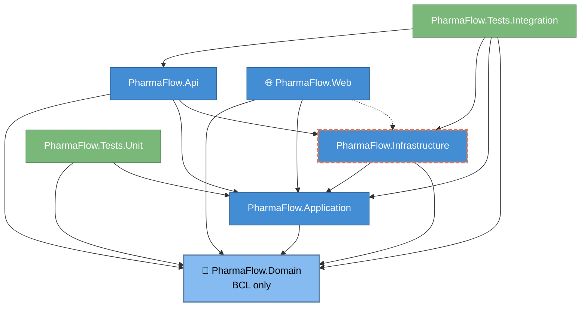

# 03 — Module Dependencies

The seven .NET projects and their compile-time references. Source: spec §7.2 (table) + actual `.csproj` `<ProjectReference>` graph as of Sprint 1 close (2026-05-01).



## Allowed reference matrix (from spec §7.2)

| Project | Depends on | MUST NOT depend on |
|---|---|---|
| **Domain** | BCL only | EF Core, ASP.NET, Mediator, FluentValidation, Serilog, Mapperly |
| **Application** | Domain, Mediator, FluentValidation, Mapperly attrs | EF Core, ASP.NET hosting, Azure SDKs, Serilog (use `M.E.Logging.Abstractions`) |
| **Infrastructure** | Application, Domain, EF Core, Npgsql, Azure SDKs, Serilog | ASP.NET hosting, Api, Web |
| **Api** | Application, Infrastructure, `Microsoft.AspNetCore.App` | EF Core types directly in endpoints (go through Mediator) |
| **Web** | **Application DTOs only** (or shared `Contracts`) per spec | EF Core, Infrastructure |
| **Tests.Unit** | Domain, Application, xUnit, FluentAssertions, NSubstitute | Infrastructure, real DB |
| **Tests.Integration** | Api, Infrastructure, `Testcontainers.PostgreSql`, xUnit | Mocking the DB |

## Drift vs spec — current state (2026-05-01)

| # | Project | Drift | Why it's there | Fix horizon |
|---|---|---|---|---|
| 1 | **Web** | References `Infrastructure` directly (orange dashed arrow above) | PFL-004 scaffold wired Web like Api so Blazor Auto-mode prerender resolves DI in-process. Spec §7.2 expects Web ⇒ Api over HTTP. | Sprint 11 (UI polish) or Sprint 12 (final hardening). Adds a `PharmaFlow.Contracts` project at the same time, splits cleanly. |
| 2 | **Web** | References `Domain` directly | Blazor components need typed IDs / `Result<T>` for forms. Pure read-only Domain types crossing the boundary is *less* harmful than Infrastructure crossing it. | Same horizon — when `PharmaFlow.Contracts` lands, move shared shapes there. |

Both drifts are tracked here so Sprint 2 DoD's `dotnet list package` check has a known, documented exception list. New drift = new row.

## Sprint 2 DoD check

Per `Sprint-02-Backlog.md` § DoD: "No reference from `PharmaFlow.Domain` to `EFCore`, `Mediator`, ASP.NET, Mapperly, Serilog. Verify with `dotnet list package` per project (Domain should list zero — only BCL)."

```bash
dotnet list src/PharmaFlow.Domain/PharmaFlow.Domain.csproj package
# expected: "Project 'PharmaFlow.Domain' has the following package references" → empty
```

If this command ever returns a row, Domain has been polluted. Investigate before merging.

## Notes

- **No `IRepository<T>`** generic — per-aggregate repos in Application *interface*, Infrastructure *impl* (spec §9.3). The diagram doesn't show interfaces; assume every Application → Infrastructure dependency goes through a Domain or Application port.
- **Application → Infrastructure?** No direct compile-time arrow. Application defines interfaces (`IStudyRepository`, `IAppDbContext`); Infrastructure implements; DI wires up at composition-root (`PharmaFlow.Api/Program.cs`). The Mermaid graph deliberately reflects compile-time edges only — runtime polymorphism lives elsewhere.
- **Tests.Unit must NEVER reference Infrastructure** — if a test needs a DB, it's an integration test (move to `Tests.Integration`). Sprint 1 retro carry-over: NetArchTest.Rules can enforce this architecturally; deferred until first violation tempts.
