# 04 — Domain Model

The shapes inside `PharmaFlow.Domain` as of Sprint 3 close (2026-05-10) — Sprint 3 was Infrastructure-side only; Domain remains structurally identical to Sprint 2 close apart from the `UserId.System` static sentinel added in PFL-030 (not shown — static accessor, not a structural addition). Source: spec §3 (entities), §9.1 (patterns), §10.1–§10.3 (typed IDs + base entity), and the Sprint 2 ticket detail (`PFL-014` / `015` / `016` / `019`–`023`).

This is **structural**, not behavioural — methods on aggregates are sketched, not exhaustive. Sprint 2 builds the empty shells + invariants; subsequent sprints fill in document/consent/auth flows.

```mermaid
classDiagram
    direction TB

    %% =========================================================
    %% Common primitives (PFL-014 / PFL-015 / PFL-016)
    %% =========================================================

    class Result {
        <<class>>
        +bool IsSuccess
        +bool IsFailure
        +Error Error
        +Success() Result$
        +Failure(Error) Result$
    }
    class ResultT~T~ {
        <<class>>
        +T Value
        +Success(T) ResultT~T~$
        +Failure(Error) ResultT~T~$
    }
    class Error {
        <<record>>
        +string Code
        +string Message
        +ErrorType ErrorType
        +Validation(c, m) Error$
        +NotFound(c, m) Error$
        +Conflict(c, m) Error$
        +None Error$
    }
    class ErrorType {
        <<enum>>
        Validation
        NotFound
        Conflict
        Unauthorized
        Forbidden
        Unexpected
    }

    class IStronglyTypedId~TKey~ {
        <<interface>>
        +TKey Value
    }
    class IDomainEvent {
        <<interface>>
        +DateTimeOffset OccurredAt
    }
    class IDomainEventDispatcher {
        <<interface>>
        +DispatchAsync(events, ct) Task
    }
    class IClock {
        <<interface>>
        +DateTimeOffset UtcNow
    }

    class EntityT~TId~ {
        <<abstract>>
        +TId Id
        +DateTimeOffset CreatedAt
        +string CreatedBy
        +DateTimeOffset UpdatedAt
        +string UpdatedBy
        +byte[] RowVersion
        +bool IsDeleted
        +IReadOnlyList~IDomainEvent~ DomainEvents
        #Raise(IDomainEvent)
        +ClearEvents()
    }

    ResultT~T~ --|> Result
    EntityT~TId~ ..> IDomainEvent : raises

    %% =========================================================
    %% Strongly-typed IDs (PFL-015)
    %% =========================================================

    class StudyId {
        <<record struct>>
        +Guid Value
        +New() StudyId$
        +Empty StudyId$
    }
    class SiteId {
        <<record struct>>
        +Guid Value
    }
    class ParticipantId {
        <<record struct>>
        +Guid Value
    }
    class UserId {
        <<record struct>>
        +Guid Value
    }
    class RoleAssignmentId {
        <<record struct>>
        +Guid Value
    }
    class SignatureId {
        <<record struct>>
        +Guid Value
    }
    class AuditEventId {
        <<record struct>>
        +long Value
        +Empty AuditEventId$
    }

    StudyId ..|> IStronglyTypedId~Guid~
    SiteId ..|> IStronglyTypedId~Guid~
    ParticipantId ..|> IStronglyTypedId~Guid~
    UserId ..|> IStronglyTypedId~Guid~
    RoleAssignmentId ..|> IStronglyTypedId~Guid~
    SignatureId ..|> IStronglyTypedId~Guid~
    AuditEventId ..|> IStronglyTypedId~long~

    %% =========================================================
    %% Value objects (PFL-019, PFL-022)
    %% =========================================================

    class SignatureMeta {
        <<record>>
        +SignatureId Id
        +UserId SignerUserId
        +DateTimeOffset SignedAt
        +string Reason
    }
    class Scope {
        <<record>>
        +ScopeKind Kind
        +StudyId? StudyId
        +SiteId? SiteId
        +System() Scope$
        +ForStudy(StudyId) Scope$
        +ForSite(SiteId) Scope$
    }
    class ScopeKind {
        <<enum>>
        System
        Study
        Site
    }

    Scope ..> ScopeKind : Kind

    %% =========================================================
    %% Aggregates inheriting Entity (PFL-019..022)
    %% =========================================================

    class Study {
        +ProtocolNumber
        +Title
        +Phase
        +TherapeuticArea
        +SponsorOrganisation
        +PlannedEnrolment
        +PlannedStartDate
        +PlannedEndDate
        +StudyStatus Status
        +Create(...) ResultT~Study~$
        +SubmitForApproval()
        +Activate(SignatureMeta)
        +Suspend(reason)
        +Close(reason)
        +Archive()
    }
    class Site {
        +SiteNumber
        +Name
        +Country
        +UserId PrincipalInvestigator
        +SiteStatus Status
        +Create(StudyId,...) ResultT~Site~$
        +Qualify()
        +Initiate()
        +Activate()
        +Close()
    }
    class Participant {
        +SubjectNumber
        +Initials
        +int YearOfBirth
        +Sex
        +ParticipantStatus EnrolmentStatus
        +Create(SiteId,...) ResultT~Participant~$
        +Screen()
        +ScreenFail(reason)
        +Consent(...)
        +Enrol()
        +Withdraw(reason)
    }
    class User {
        +Username
        +Email
        +FullName
        +DisplayTitle
        +UserStatus Status
        +bool MfaEnrolled
        +Create(...) ResultT~User~$
        +Activate()
        +Lock()
        +Deactivate()
    }
    class RoleAssignment {
        +UserId UserId
        +Role Role
        +Scope Scope
        +DateTimeOffset AssignedAt
        +DateTimeOffset? EndedAt
        +SignatureId AssignedBySignatureId
        +SignatureId? EndedBySignatureId
        +End(SignatureId, IClock)
    }

    Study --|> EntityT~TId~
    Site --|> EntityT~TId~
    Participant --|> EntityT~TId~
    User --|> EntityT~TId~
    RoleAssignment --|> EntityT~TId~

    Site "many" --o "1" Study : StudyId
    Participant "many" --o "1" Site : SiteId
    RoleAssignment "many" --o "1" User : UserId
    RoleAssignment "1" *-- "1" Scope : owns

    %% =========================================================
    %% Append-only types — NO Entity inheritance (PFL-023)
    %% =========================================================

    class AuditEvent {
        <<append-only class>>
        +AuditEventId Id
        +DateTimeOffset OccurredAt
        +UserId ActorUserId
        +string ActorRoleAtTime
        +AuditEventType EventType
        +string TargetEntityType
        +string TargetEntityId
        +string? BeforeStateJson
        +string? AfterStateJson
        +string? ReasonForChange
        +string EventPayloadHash
        +string? PreviousEventHash
    }
    class SignatureRecord {
        <<append-only class>>
        +SignatureId Id
        +UserId SignerUserId
        +DateTimeOffset SignedAt
        +SignatureMeaning Meaning
        +string TargetEntityType
        +string TargetEntityId
        +string TargetVersionOrHash
        +string ReasonStatement
        +AuthenticationMethod AuthenticationMethod
        +string SignaturePayloadHash
        +string? PreviousSignatureHash
    }

    %% =========================================================
    %% Deferred — feature-sprint aggregates (Sprint 7..9)
    %% =========================================================

    class Document {
        <<deferred — Sprint 7>>
    }
    class DocumentVersion {
        <<deferred — Sprint 7>>
    }
    class ConsentRecord {
        <<deferred — Sprint 9>>
    }
```

## Reading guide

- **Solid arrowheads (▲)** = inheritance.
- **Dashed arrowheads (...|>)** = interface implementation.
- **Aggregation diamonds** = "X belongs to Y by ID" — these are cross-aggregate references *by typed ID only*, never by object reference (spec §9.1).

## Key invariants enforced in Domain (Sprint 2)

| Invariant | Where | Test ticket |
|---|---|---|
| Factory rejects invalid construction → `Error.Validation` | `Study.Create`, `Site.Create`, `Participant.Create`, `User.Create` | PFL-019 / 020 / 021 / 022 |
| Strict state-machine transitions; illegal moves → `Error.Conflict` | `Study.Activate`, `Site.Initiate`, `Participant.Withdraw`, etc. | PFL-019..022 |
| Pseudonymisation hard-baked: no PII fields accepted | `Participant.Create` (max-3-char Initials, YearOfBirth not full DOB) | PFL-021 |
| `AuditEvent` / `SignatureRecord` carry no setters; constructed-once | both classes — no `: Entity<TId>` | PFL-023 |
| Reason-for-change required on every state transition | every aggregate `Suspend / Close / Withdraw` | PFL-019..022 |

## What this diagram deliberately omits

- **Methods are illustrative, not exhaustive.** Each aggregate ticket (PFL-019..023) has the full method list + state-machine table.
- **Value objects shipped Sprint 2:** `SignatureMeta` (PFL-019, used by `Study.Activate(SignatureMeta)`) and `Scope` (PFL-022, owned by `RoleAssignment`) — both included in the diagram above. **Still deferred:** `Address`, `ContactInfo` will land alongside the aggregate that first needs them.
- **`Document`, `DocumentVersion`, `ConsentRecord`, `ProtocolDeviation`** — deferred to feature sprints (7 / 8 / 9 / v1.5). Placeholder boxes show they're known-shape, not unknown.
- **EF Core mappings** — not domain. Sprint 3 documents in `Docs/Architecture/05-persistence.md` (future).
- **Mediator request/handler shapes** — not domain. Sprint 4 documents in `Docs/Architecture/06-cqrs-pipeline.md` (future).

## Living-document policy

Update this file when:
1. A new aggregate ticket is fleshed (add the class + relationships).
2. An invariant moves between aggregates (rare, but document it).
3. A typed ID is added or retired.
4. A "deferred" placeholder graduates to a real aggregate.

Do **not** update it for: method-signature changes, internal helper classes, or anything below the aggregate-root level. Those belong in code; this doc is for reviewers.
